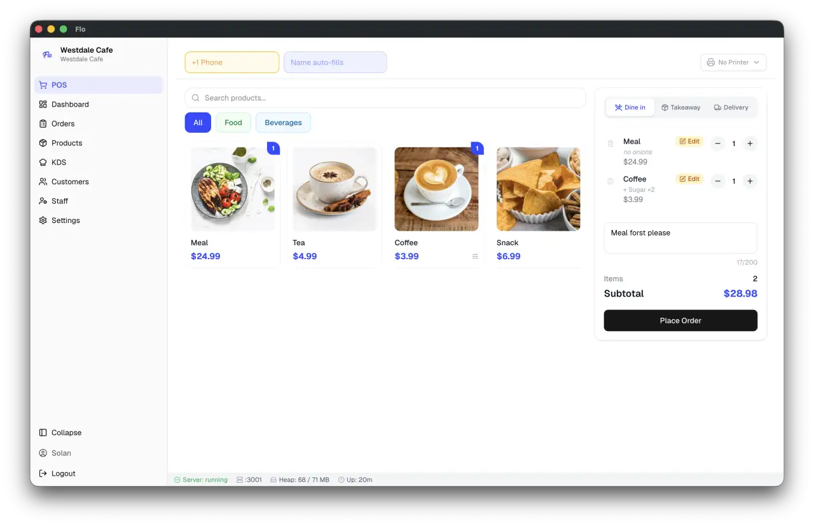

<div align="center">
  <h1>BuonApp</h1>
  <p><strong>Free, open-source, offline-first point of sale for restaurants with table service.</strong></p>
  <p>
    <a href="https://github.com/MrD0me/BuonApp/releases">Download</a> ·
    <a href="https://github.com/MrD0me/BuonApp/issues">Report a bug</a> ·
    <a href="docs/README.md">Documentation</a>
  </p>
  <p>
    <a href="https://github.com/MrD0me/BuonApp/releases"></a>
    <a href="https://github.com/MrD0me/BuonApp/releases"></a>
    <a href="https://github.com/MrD0me/BuonApp/blob/main/LICENSE"></a>
    
    <a href="https://github.com/MrD0me/BuonApp/actions/workflows/ci.yml"></a>
  </p>
</div>

<p align="center">
  
</p>

BuonApp runs on the restaurant's own computer. Orders, tables, bills, and backups live in a local SQLite database, so the till, the floor map, and the kitchen printers keep working when the internet does not. There is no account to create, no vendor server to phone home to, and no usage telemetry. The only features that reach the network are the ones the owner switches on — Google Drive backup and WhatsApp bill delivery — plus the update check against this repository's own releases.

> BuonApp began as a fork of [FloCafe](https://github.com/FreeOpenSourcePOS/FloCafe) and has diverged since: the cloud bridge and the telemetry are gone, the dining room is modelled as a map with service days and reservations, and kitchen tickets print by round. See the [changelog](CHANGELOG.md) for what changed and why.

## Get BuonApp

Download the Windows installer from [GitHub Releases](https://github.com/MrD0me/BuonApp/releases). The installer is not code-signed, so Windows shows a SmartScreen prompt on first install — choose **More info → Run anyway**. In-app updates work from there on.

macOS and Linux are not published as releases: signing and store credentials this fork does not have used to fail the release job and take the Windows installer down with them. Both still build from source:

```sh
npm run build:mac      # dmg and zip
npm run build:linux    # AppImage, deb, rpm, snap
```

For Linux package choices, FUSE setup, CUPS printing, and tray behaviour, see [Linux installation and support](docs/linux.md).

### System requirements

| Requirement | Minimum |
| --- | --- |
| Operating system | Windows 10 or later (macOS 12+ and current Linux distributions build from source) |
| Memory | 4 GB RAM |
| Storage | 500 MB free space, plus room for local backups |
| Network | A private LAN, if handhelds, a kitchen display, or network printers are used |

Node.js is only required to develop BuonApp, not to run a packaged release.

## What it does

- **The dining room as a map:** Rooms are real entities, and each is drawn as a floor plan rather than a grid of cards. Tables carry a shape, a size, and a horizontal or vertical orientation, and are dragged into place in edit mode. Two tables can be pushed together into one group led by a single table, and a floor plan can be saved by name and re-applied on a later evening.
- **Service days:** Every order is filed under an explicit service day instead of a UTC date, so a service that runs past midnight stays one evening. The day opens by itself on the first order and closes as a ritual: the close refuses to start while orders are open or bills unpaid, freezes the totals before touching anything, then clears the floor and — if asked — deletes the tables. The closing report prints on the thermal printer.
- **Reservations:** Bookings belong to the service day in front of you, not to future dates, and need only a name and a head count. A reservation can be taken before anyone decides where it sits; assigning it to a table that is already held swaps the two bookings in a single move.
- **Order workflows:** Dine-in, counter, takeaway, and delivery orders — only the types the house actually takes — held orders shared across devices, per-item and per-order discounts, and a price that can be written on the row for anything sold at an open price. An order is drawn up, cashed and reprinted from one place: the table in the floor plan, or the service day for takeaway and delivery. The ordering screen composes and sends, and takes no money — the till is the machine standing beside the computer.
- **Cover charge:** A price per cover, set once, carried by every dine-in order by head count and printed on the preconto. Changing the covers on an open order re-prices it, and the printed line spells out `Cover 4 x 2,00` only when that multiplication really gives the amount beside it.
- **Fixed menus:** A set menu at one price — starter, pasta, main, fruit or dessert, water, sometimes the wine — composed course by course as the order is taken. It writes real rows, one per dish, so the kitchen ticket sections them by category as usual while the bill shows the one price with the dishes indented beneath it and a surcharge only where there is one. A menu that includes the cover takes its guest off the cover charge, and cancelling any row of a menu takes the whole menu off the check.
- **Kitchen tickets by round:** Sending an order prints only the rows that have never been to the kitchen, numbered as a sequential round. Adding a course to an open table and sending again prints that course alone. Rows are routed to the kitchen station that owns their category, and a station that fails to print keeps its rows queued for the next send.
- **Thermal printing:** ESC/POS over USB, local network (TCP 9100), and OS print queues, plus WebUSB in a compatible browser. 58 mm and 80 mm paper, per-printer column widths, and a WPC1252 code page so accented characters and the euro sign print as written. Receipt and ticket labels are rendered in English or Italian.
- **Tableside handheld:** A Server App on port `3003` lets waiters take and extend orders from a phone or tablet on the same LAN. Sending from a handheld fires the kitchen ticket exactly as the till does; handhelds cannot change the floor.
- **Kitchen display:** An optional standalone KDS server on port `3002`, for kitchens that work off a screen instead of paper. It can be switched off entirely, and its endpoints then answer `403`.
- **Catalog:** Products with images and barcodes, categories, add-on groups, fixed menus, and CSV menu import/export.
- **Customer display:** A second screen showing the running order and the payment status to the guest.
- **Optional customer book:** The customer list, the loyalty wallet, and the customer field at the till are one switch in Settings. A restaurant that keeps only reservations turns them off, and the write endpoints close with them.
- **Staff and accountability:** Owner, Manager, Cashier, Server, and Chef roles, manager PIN overrides for voids and cancellations, and a print log kept per bill.
- **Data protection:** Local SQLite with a timestamped backup taken automatically before every schema migration, manual backup and restore, database health checks, and optional Google Drive backup.

## Offline-first by design

Order entry, billing, table management, kitchen tickets, and printing never depend on internet access.

- **No vendor channel:** The cloud bridge that used to register the installation with a vendor dashboard, and the anonymous telemetry that ran beside it, were removed in 4.0.0 — service, outbox tables, settings, and stored credentials alike. Migration v80 clears them from existing databases, and restoring an old backup does not bring them back.
- **Data location:** The SQLite database and local backups live in the operating-system user-data directory, separate from the installed binaries, and survive in-place updates. Take a manual backup anyway before reinstalling or moving to another machine.
- **Upgrading from Flo Cafe:** On first launch BuonApp copies an existing `flo-desktop` user-data directory into its own, so an install that predates the rename keeps its database, backups, Google Drive token, Master PIN, and WhatsApp session. The old directory is copied, not moved, so rolling back to an older build still finds its data.
- **Optional network features:** Google Drive backup and WhatsApp bill delivery reach the network only once the owner configures and enables them, and fail gracefully when offline.
- **On the LAN:** The POS advertises itself over mDNS as `buonapp.local` — the till on `:3001`, the kitchen display on `:3002`, and the handheld Server App on `:3003`.

## Languages

BuonApp ships UI translations for:

- English
- Italian
- Spanish
- Brazilian Portuguese
- Persian (Farsi), including RTL layout support

UI language is independent of the store's country and regional settings. Receipts and kitchen tickets follow the UI language in English or Italian and fall back to English for the other three, rather than printing a half-translated bill. To edit a translation or add a language, see the [Internationalization and translation guide](docs/i18n.md).

## Bills

BuonApp computes no taxes at all: an item costs what the menu says, and the bill is the sum of what was ordered, plus the cover where the house charges one. The document it prints is a **preconto** — what the table owes, for the guest and for the till — and never a fiscal receipt. The business registration number can be printed in the header if the owner turns it on, but it is only identity, not a tax figure.

> **Notice:** in several countries a fiscal receipt has to come from certified hardware. BuonApp does not replace it, and does not try to: issue the receipt from whatever the business already uses for it.

## Development

A local development environment needs Node.js 22 or later:

```sh
git clone https://github.com/MrD0me/BuonApp.git
cd BuonApp
npm install
npm run dev
```

`npm run dev` builds the frontend and backend, then launches Electron.

### Architecture

```text
Electron main process
├── Express API and WebSocket server         :3001
├── Standalone kitchen-display server        :3002
├── Server App for tableside handhelds       :3003
└── SQLite database, migrations, and ESC/POS printing
                 ↕ HTTP and WebSocket
Next.js renderer
└── React UI and Zustand client state
```

For developer workflows, coding standards, branch conventions, and testing procedures, see [CONTRIBUTING.md](CONTRIBUTING.md).

## Contributing

Contributions are welcome. Please read [CONTRIBUTING.md](CONTRIBUTING.md) before starting work:

- **Small bug fixes, documentation improvements, and focused tests** can be started freely.
- **New features, database schema changes, and architectural refactors** are worth raising in an issue first, since this fork is shaped around one restaurant's way of working.

## Help and documentation

- **Documentation index:** [docs/README.md](docs/README.md)
- **Table management, service days & reservations:** [docs/table-management.md](docs/table-management.md)
- **Printer guide & troubleshooting:** [docs/printers.md](docs/printers.md)
- **Local API reference:** [docs/API.md](docs/API.md)
- **Linux setup & support:** [docs/linux.md](docs/linux.md)
- **Internationalization & translations:** [docs/i18n.md](docs/i18n.md)
- **Google Drive backup setup:** [docs/google-drive-setup.md](docs/google-drive-setup.md)
- **Bug reports & feature proposals:** [GitHub Issues](https://github.com/MrD0me/BuonApp/issues)

## License

BuonApp is open-source software licensed under the [MIT License](LICENSE), and keeps the copyright of the FloCafe contributors it was forked from.
