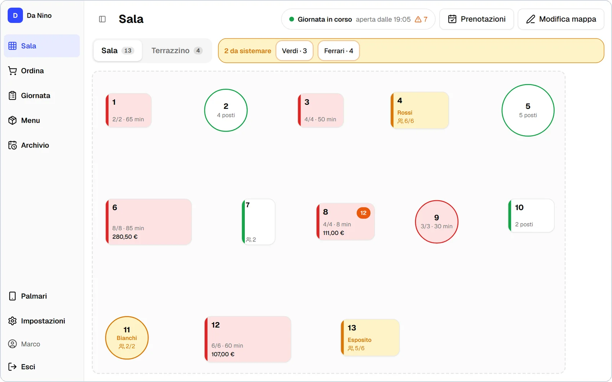
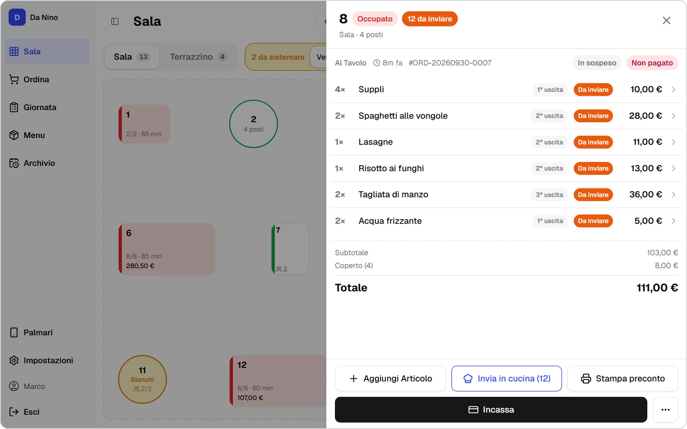
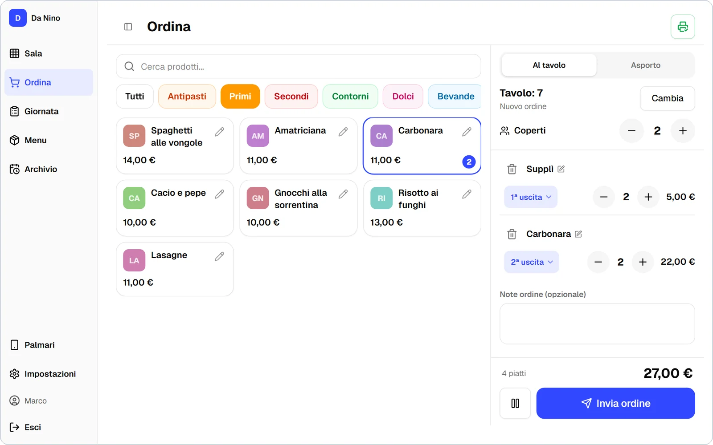
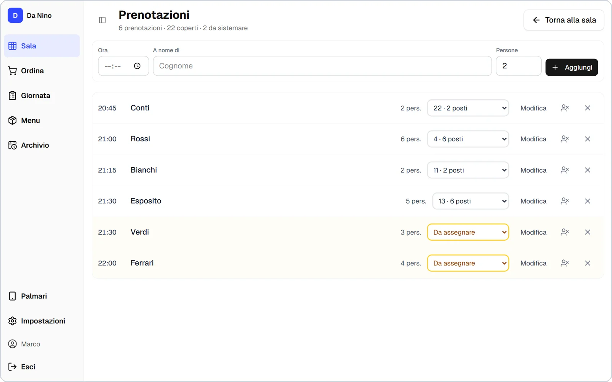
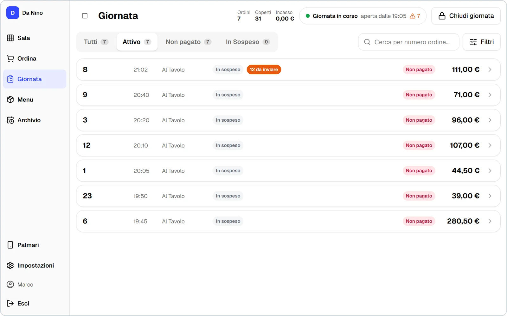
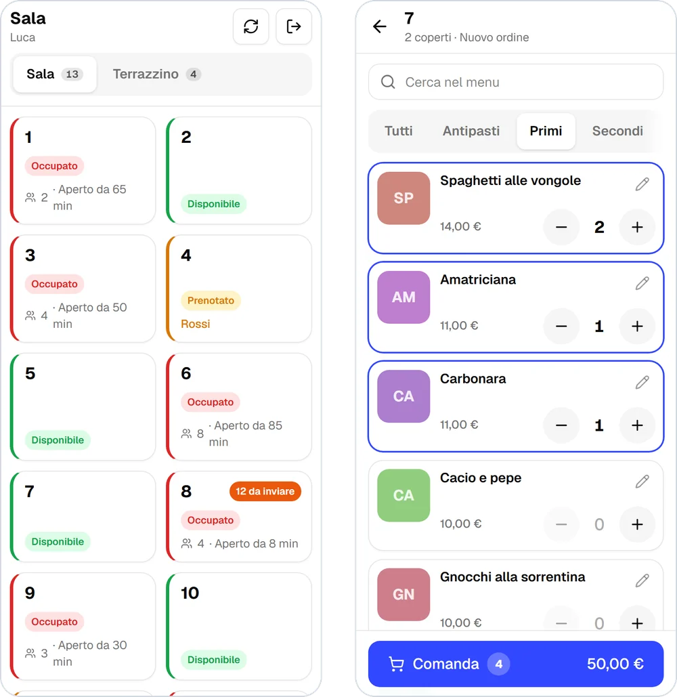
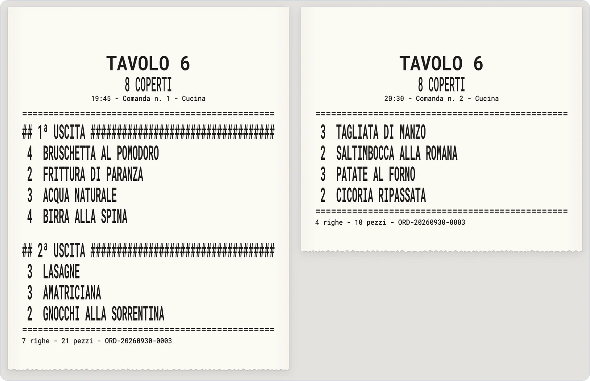

<div align="center">
  <h1>BuonApp</h1>
  <p><strong>Free, open-source, offline-first point of sale for restaurants with table service.</strong></p>
  <p>
    <a href="https://github.com/MrD0me/BuonApp/releases">Download</a> ·
    <a href="https://github.com/MrD0me/BuonApp/issues">Report a bug</a> ·
    <a href="docs/README.md">Documentation</a>
  </p>
  <p>
    <a href="https://github.com/MrD0me/BuonApp/releases"></a>
    <a href="https://github.com/MrD0me/BuonApp/releases"></a>
    <a href="https://github.com/MrD0me/BuonApp/blob/main/LICENSE"></a>
    
    <a href="https://github.com/MrD0me/BuonApp/actions/workflows/ci.yml"></a>
  </p>
</div>

<p align="center">
  
</p>

BuonApp runs on the restaurant's own computer. Orders, tables, bills, and backups live in a local SQLite database, so the till, the floor map, and the kitchen printers keep working when the internet does not. There is no account to create, no vendor server to phone home to, and no usage telemetry. The only feature that reaches the network is one the owner switches on — Google Drive backup — plus the update check against this repository's own releases. WhatsApp bill delivery is still in the code, but switched off.

> BuonApp began as a fork of [FloCafe](https://github.com/FreeOpenSourcePOS/FloCafe) and has diverged since: the cloud bridge and the telemetry are gone, the dining room is modelled as a map with service days and reservations, kitchen tickets print by round, and the interface was redrawn for a touch screen at the till. See the [changelog](CHANGELOG.md) for what changed and why.

## Get BuonApp

Download the Windows installer from [GitHub Releases](https://github.com/MrD0me/BuonApp/releases). The installer is not code-signed, so Windows shows a SmartScreen prompt on first install — choose **More info → Run anyway**. In-app updates work from there on.

macOS and Linux are not published as releases: signing and store credentials this fork does not have used to fail the release job and take the Windows installer down with them. Both still build from source:

```sh
npm run build:mac      # dmg and zip
npm run build:linux    # AppImage, deb, rpm, snap
```

For Linux package choices, FUSE setup, CUPS printing, and tray behaviour, see [Linux installation and support](docs/linux.md).

### System requirements

| Requirement | Minimum |
| --- | --- |
| Operating system | Windows 10 or later (macOS 12+ and current Linux distributions build from source) |
| Display | 1024x768 or larger; the interface is designed for a touch monitor |
| Memory | 4 GB RAM |
| Storage | 500 MB free space, plus room for local backups |
| Network | A private LAN, if handhelds, a kitchen display, or network printers are used |

Node.js is only required to develop BuonApp, not to run a packaged release.

## What it does

- **The dining room as a map:** Rooms are real entities, and each is drawn as a floor plan rather than a grid of cards. Tables are round or rectangular, medium, large or banquet, lying down or standing up, and are dragged into place in edit mode; a large party is seated by changing the map, not by joining tables. In service the map is fitted to the screen and framed on the tables, and a booked table writes whose it is and how many are coming. A floor plan can be saved by name and re-applied on a later evening.
- **Service days:** Every order is filed under an explicit service day instead of a UTC date, so a service that runs past midnight stays one evening. The day opens by itself on the first order and closes as a ritual: the close refuses to start while orders are open or bills unpaid — unless the owner forces it and writes down why — freezes the totals before touching anything, then clears the floor and — if asked — deletes the tables. The closing report prints on the thermal printer.
- **Reservations:** Bookings belong to the service day in front of you, not to future dates, and need only a name and a head count. A reservation can be taken before anyone decides where it sits — the ones still to seat wait in a row above the map — and assigning it to a table that is already booked swaps the two bookings in a single move. A party that asks for another table is moved from the table's own card.
- **Order workflows:** Dine-in, takeaway, and delivery orders — only the types the house actually takes — carts held on a table and shared across devices, and a price that can be written on the row for anything sold at an open price. An order is drawn up, cashed and reprinted from one place: the table in the floor plan, or the day's list for takeaway and delivery. With table service the ordering screen composes and sends, and takes no money — the till is the machine standing beside the computer.
- **Discounts:** Per item or on the whole check. The check can be brought down in three ways, each switched on or off in Settings: a percentage, a flat amount, or the new total the table is told — "it's 53.40, call it 50" — with round figures offered to tap and the discount worked out by the server. A maximum percentage and a maximum amount cap them, a manager PIN can be required, and a discount given by mistake can be taken off.
- **Cover charge:** A price per cover, set once, carried by every dine-in order by head count and printed on the preconto. A new order's covers start from the booking's party, or from the table's seats. Changing the covers on an open order re-prices it, and the printed line spells out `Cover 4 x 2,00` only when that multiplication really gives the amount beside it.
- **Fixed menus:** A set menu at one price — starter, pasta, main, fruit or dessert, water, sometimes the wine — rung up the way the floor writes it on the pad: how many menus, then how many of each dish, without asking who eats what. One line carries the number and the price, and under it the menu writes real rows, one per portion, so the kitchen ticket sections them by category as usual and a single portion can carry a note of its own, while the bill folds the identical ones into `Lasagne 3` indented beneath the menu, with a surcharge only where there is one. A course can be left empty and filled later from the table, a dish tapped on the grid can go inside a menu still open, and how many menus a line holds can be changed while the check is open, for the friend who arrives late. A menu that includes the cover takes its guests off the cover charge; cancelling the menu's own row takes the whole menu off the check, and cancelling a dish takes only that dish.
- **Kitchen tickets by round:** Sending an order prints only the rows that have never been to the kitchen, numbered as a sequential round. Adding a course to an open table and sending again prints that course alone. Each dish also carries its service run — starters, then pasta, then mains — taken from its category and movable by the floor, and the ticket is sectioned by run. Identical dishes are folded into one line with the quantity summed, while a dish carrying a note keeps a line of its own. The covers print large under the table, and a note for the whole table comes before the first dish. Rows are routed to the kitchen station that owns their category, and a station that fails to print keeps its rows queued for the next send.
- **Thermal printing:** ESC/POS over USB, local network (TCP 9100), and OS print queues, plus WebUSB in a compatible browser for bills — a kitchen ticket always prints from the backend, which owns the rounds and the stations. 58 mm and 80 mm paper, per-printer column widths, and a WPC1252 code page so accented characters and the euro sign print as written. Receipt and ticket labels are rendered in English or Italian.
- **Tableside handheld:** A Server App on port `3003` lets waiters take and extend orders from a phone or tablet on the same LAN: a read-only view of the floor, then the menu with a stepper beside each dish, the till's own windows for extras, fixed menus and service runs, and the covers corrected from the phone. The phone gets there by scanning the code under **Handhelds** in the till's sidebar, and signs in with a waiter's own account. Any waiter can work any open order. Sending from a handheld fires the kitchen ticket exactly as the till does; handhelds take no money and cannot change the floor. A phone that drops off the Wi-Fi keeps the ticket and sends it by itself when the PC answers again, and a ticket half written survives a reload.
- **Kitchen display:** An optional standalone KDS server on port `3002`, for kitchens that work off a screen instead of paper. It can be switched off entirely, which closes its endpoints.
- **Catalog:** Products with images and barcodes, categories, add-on groups, fixed menus, and CSV menu import/export.
- **Optional customer book:** The customer list, the loyalty wallet, and the customer field at the till are one switch in Settings. A restaurant that keeps only reservations turns them off, and the write endpoints close with them.
- **Staff and accountability:** Owner, Manager, Cashier, Server, and Chef roles, each signing in with a username and a password — no email, since nothing here sends mail — manager PIN overrides for voids and cancellations, and a print log kept per bill.
- **Data protection:** Local SQLite with a timestamped backup taken automatically before every schema migration, manual backup and restore, database health checks, and optional Google Drive backup.

## A look around

The till BuonApp was built for is a touch monitor, so the interface was redrawn in 6.0.0 for fingers: every target is at least 44 px, nothing depends on hovering, and the same colours mean the same thing on every screen and on the handheld — green free, red occupied, amber booked, orange still to send to the kitchen. The sidebar holds the screens of a service — **Floor**, **Order**, **Today**, **Menu**, **Archive** — with **Handhelds** and **Settings** at its foot. On a 1024x768 screen the window opens at 90% zoom, so every page fits.

The screenshots below come from a test database, with the interface in Italian, the language of the restaurant it runs in.

**A table's card.** The order with its service runs and the covers; what has not reached the kitchen yet is marked in orange. It is sent, printed as a preconto, and cashed from here.



**Order.** The menu by category, and the ticket beside it. Each dish takes its service run from its category, and the floor can move it.



**Bookings.** The evening's sheet: a name and a head count are enough, and the table can come later.



**Today.** The service day's orders, what is still unpaid or waiting for the kitchen, and the day's close.



<table>
  <tr>
    <td width="39%"></td>
    <td width="61%"></td>
  </tr>
  <tr>
    <td><b>Handheld.</b> The floor on a waiter's phone, then the menu; sending fires the kitchen ticket.</td>
    <td><b>Kitchen tickets.</b> Two rounds for one table: the second prints only what was added.</td>
  </tr>
</table>

## Offline-first by design

Order entry, billing, table management, kitchen tickets, and printing never depend on internet access.

- **No vendor channel:** The cloud bridge that used to register the installation with a vendor dashboard, and the anonymous telemetry that ran beside it, were removed in 4.0.0 — service, outbox tables, settings, and stored credentials alike. Migration v80 clears them from existing databases, and restoring an old backup does not bring them back.
- **Data location:** The SQLite database and local backups live in the operating-system user-data directory, separate from the installed binaries, and survive in-place updates. Take a manual backup anyway before reinstalling or moving to another machine.
- **Upgrading from Flo Cafe:** On first launch BuonApp copies an existing `flo-desktop` user-data directory into its own, so an install that predates the rename keeps its database, backups, Google Drive token, Master PIN, and WhatsApp session. The old directory is copied, not moved, so rolling back to an older build still finds its data.
- **Optional network features:** Google Drive backup reaches the network only once the owner configures and enables it, and fails gracefully when offline. WhatsApp bill delivery is still in the code but switched off (`WHATSAPP_AVAILABLE` in `main/features.ts` and `frontend/src/lib/features.ts`): no screen offers it and its service never starts.
- **On the LAN:** The POS advertises itself over mDNS as `buonapp.local` — the till on `:3001`, the kitchen display on `:3002`, and the handheld Server App on `:3003`.

## Languages

BuonApp ships UI translations for:

- English
- Italian
- Spanish
- Brazilian Portuguese
- Persian (Farsi), including RTL layout support

UI language is independent of the store's country and regional settings. Receipts and kitchen tickets follow the UI language in English or Italian and fall back to English for the other three, rather than printing a half-translated bill. To edit a translation or add a language, see the [Internationalization and translation guide](docs/i18n.md).

## Bills

BuonApp computes no taxes at all: an item costs what the menu says, and the bill is the sum of what was ordered, plus the cover where the house charges one. The document it prints is a **preconto** — what the table owes, for the guest and for the till — and never a fiscal receipt. The business registration number can be printed in the header if the owner turns it on, but it is only identity, not a tax figure.

One order has one bill. Splitting a check between guests was removed in 5.0.0: who among the party pays what is settled at the till. Paying one bill with several methods is a different thing, and stays.

> **Notice:** in several countries a fiscal receipt has to come from certified hardware. BuonApp does not replace it, and does not try to: issue the receipt from whatever the business already uses for it.

## Development

A local development environment needs Node.js 22.12 or later:

```sh
git clone https://github.com/MrD0me/BuonApp.git
cd BuonApp
npm install
npm run dev
```

`npm run dev` builds the frontend and backend, then launches Electron.

### Architecture

```text
Electron main process
├── Express API and WebSocket server         :3001
├── Standalone kitchen-display server        :3002
├── Server App for tableside handhelds       :3003
└── SQLite database, migrations, and ESC/POS printing
                 ↕ HTTP and WebSocket
Next.js renderer
└── React UI and Zustand client state
```

For developer workflows, coding standards, branch conventions, and testing procedures, see [CONTRIBUTING.md](CONTRIBUTING.md).

## Contributing

Contributions are welcome. Please read [CONTRIBUTING.md](CONTRIBUTING.md) before starting work:

- **Small bug fixes, documentation improvements, and focused tests** can be started freely.
- **New features, database schema changes, and architectural refactors** are worth raising in an issue first, since this fork is shaped around one restaurant's way of working.

## Help and documentation

- **Documentation index:** [docs/README.md](docs/README.md)
- **Table management, service days & reservations:** [docs/table-management.md](docs/table-management.md)
- **Printer guide & troubleshooting:** [docs/printers.md](docs/printers.md)
- **Order flow & navigation** (in Italian): [docs/order-flow-and-navigation.md](docs/order-flow-and-navigation.md)
- **Cover charge & fixed menus** (in Italian): [docs/coperto-e-menu-fisso.md](docs/coperto-e-menu-fisso.md)
- **The touch interface, screen by screen** (in Italian): [docs/rifacimento-grafica.md](docs/rifacimento-grafica.md)
- **The handheld Server App** (in Italian): [docs/palmare.md](docs/palmare.md)
- **Local API reference:** [docs/API.md](docs/API.md)
- **Linux setup & support:** [docs/linux.md](docs/linux.md)
- **Internationalization & translations:** [docs/i18n.md](docs/i18n.md)
- **Google Drive backup setup:** [docs/google-drive-setup.md](docs/google-drive-setup.md)
- **Bug reports & feature proposals:** [GitHub Issues](https://github.com/MrD0me/BuonApp/issues)

## License

BuonApp is open-source software licensed under the [MIT License](LICENSE), and keeps the copyright of the FloCafe contributors it was forked from.
